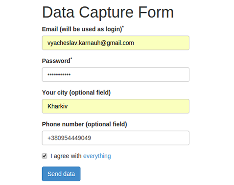

# [Form Validation](http://viacheslav-karnaukh.github.io/form-validation)



Form validation activates on `keyup`, `change` or `blur` events. Email and password fields are mandatory for filling. The possibility to use an email depends on its availability, i.e. if email is already taken it is not available. All the taken emails are stored either on the client in `usedEmails` array or on the server. To add new emails on the server you can use [this server](https://aqueous-reaches-8130.herokuapp.com/). Here are the used emails which are predefined and stored in the array on the client:

```javascript
var usedEmails = ['author@mail.com', 'foo@mail.com', 'tester@mail.com'];
```