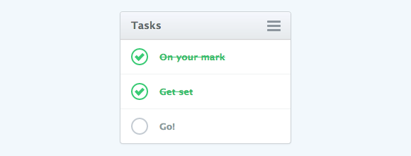

# [Task List](http://viacheslav-karnaukh.github.io/tasklist)

The task list is created using HTML and CSS. It has custom checkboxes, which are clickable and change their styles with the help of CSS when checked.